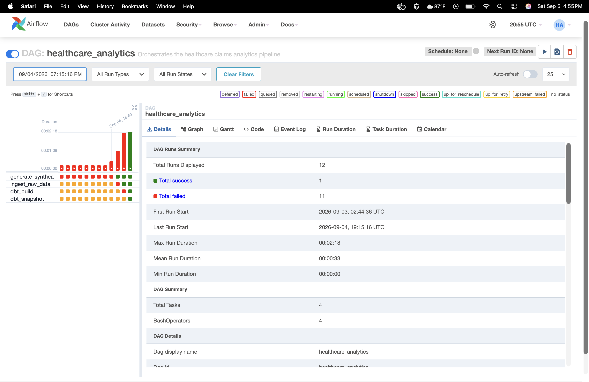

# Healthcare Claims Intelligence Platform

An end-to-end healthcare analytics engineering platform that transforms synthetic claims and eligibility data into tested, analytics-ready datasets using **Python, PostgreSQL, dbt, Apache Airflow, Docker, and GitHub Actions**.

The project demonstrates a production-style analytics workflow spanning data generation, ingestion, dimensional transformation, healthcare business logic, orchestration, testing, lineage, and continuous integration.

> All healthcare data used in this project is synthetically generated with Synthea. No PHI or real patient data is used.

---

## Architecture

```text
Synthea
   ↓
Python Ingestion
   ↓
PostgreSQL Raw Layer
   ↓
dbt Staging
   ↓
dbt Intermediate
   ↓
dbt Analytics Marts
   ↓
Claims & Member-Month Metrics
```

**Apache Airflow** orchestrates pipeline execution while **GitHub Actions** rebuilds and validates the platform in CI.

### Airflow Orchestration



The Airflow DAG executes the core pipeline in dependency order:

```text
generate_synthea
      ↓
ingest_raw_data
      ↓
dbt_build
      ↓
dbt_snapshot
```

---

## dbt Data Lineage


The dbt project separates transformation logic into staging, intermediate, mart, and snapshot layers.

### Claims Path

```text
claims_transactions
        ↓
stg_synthea__claims_transactions
        ↓
int_claim_transactions_classified
        ↓
int_claim_financials
        ↓
fct_claims
```

### Eligibility Path

```text
payer_transitions
        ↓
stg_synthea__payer_transitions
        ↓
int_member_eligibility_spans
        ↓
int_member_months
        ↓
fct_member_month
```

The claims and member-month paths converge in:

```text
fct_monthly_claim_metrics
```

---

## Analytics Models

### `fct_claims`

**Grain: one row per claim**

Combines claim attributes with aggregated financial transactions, including:

- Charges
- Payments
- Transfer-in amounts
- Transfer-out amounts
- Transaction counts
- Payer and provider attributes

### `fct_member_month`

**Grain: one row per patient per coverage month**

Transforms payer eligibility spans into a member-month structure suitable for utilization and eligibility analytics.

### `fct_monthly_claim_metrics`

Combines claims activity with member-month eligibility to create monthly healthcare analytics metrics for downstream reporting and analysis.

### `snap_payer_transitions`

Uses dbt snapshots to preserve historical changes in payer coverage information.

---

## Data Quality & Testing

The project uses multiple layers of automated testing.

### dbt Tests

Model-level tests validate:

- Primary key uniqueness
- Non-null identifiers
- Model grain
- Data relationships
- Transformation assumptions

### Integration Tests

`pytest` integration tests query PostgreSQL after pipeline execution and verify critical data contracts:

- `fct_claims` contains one row per claim
- `fct_member_month` contains no duplicate patient-month records
- `fct_monthly_claim_metrics` contains downstream output
- `snap_payer_transitions` contains historical records

Run integration tests with:

```bash
pytest integration_tests/test_pipeline.py -v
```

---

## Continuous Integration

GitHub Actions validates the project from a clean environment.

Each CI run:

1. Builds Docker images
2. Starts PostgreSQL
3. Generates synthetic healthcare data
4. Ingests raw data
5. Installs dbt dependencies
6. Runs `dbt build`
7. Runs dbt snapshots
8. Executes Python integration tests

This verifies that the complete analytics platform can be reproduced independently of the local development environment.

---

## Technology Stack

| Layer | Technology |
|---|---|
| Synthetic Healthcare Data | Synthea |
| Ingestion | Python |
| Database | PostgreSQL |
| Transformation | dbt |
| Orchestration | Apache Airflow |
| Containerization | Docker / Docker Compose |
| Integration Testing | pytest + psycopg2 |
| CI/CD | GitHub Actions |
| Version Control | Git / GitHub |

---

## Repository Structure

```text
healthcare-claims-intelligence/
├── .github/
│   └── workflows/
│       └── ci.yml
├── airflow/
│   └── dags/
├── data/
│   └── raw/
├── dbt/
│   ├── models/
│   ├── snapshots/
│   └── tests/
├── docs/
│   ├── adr/
│   ├── airflow-dag-success.png
│   ├── architecture.md
│   ├── data_model.md
│   ├── dbt-lineage.png
│   └──