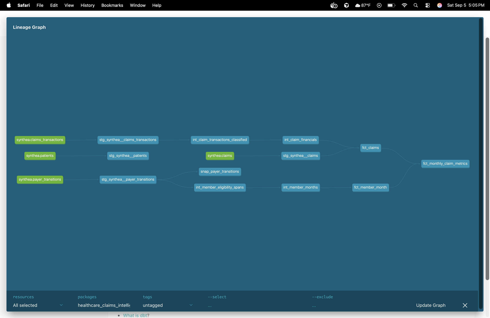

## Overview

The analytics layer transforms raw Synthea healthcare data into claims-level, member-month, and monthly aggregate datasets.

The model is designed around two primary analytical paths:

1. Claims and financial activity

2. Member eligibility and payer coverage

These paths converge in the monthly claims metrics mart.

## dbt Lineage



## Claims Pipeline

```text

synthea.claims_transactions

        ↓

stg_synthea__claims_transactions

        ↓

int_claim_transactions_classified

        ↓

int_claim_financials

        ↓

fct_claims